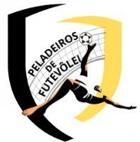
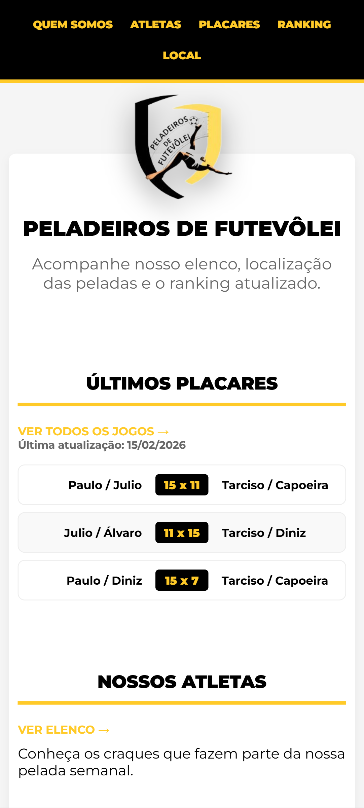

  
  
  <h1>⚽ Peladeiros</h1>

  

    
    
    
    
  

  
<strong>Gestão visual e organização para a pelada da galera.</strong>

  <a href="https://rubensbmelo.github.io/PeladeirosFTV/">
    <h3>🔗 Clique aqui para ver o projeto online</h3>
  </a>

 

## 📋 Sobre o Projeto
Este projeto nasceu da necessidade de organizar o ranking dos atletas de forma clara e acessível. Atualmente, o foco é a **experiência do usuário no celular**, garantindo que as tabelas de pontos sejam fáceis de ler em qualquer lugar.

## 🚀 Tecnologias Utilizadas
* **HTML5**: Estrutura semântica para dados e tabelas.
* **CSS3**: Layout responsivo com Flexbox e ajustes Mobile-First.
* **Design**: Foco em usabilidade e interface limpa (Clean UI).

## 📸 Preview

  
<i>Visualização do Ranking no Mobile (Simulado via DevTools)</i>

  

## 🛠️ Próximos Passos
Como estou cursando **Análise e Desenvolvimento de Sistemas (ADS)**, o plano de evolução deste software inclui:
- [ ] Implementar **JavaScript** para cálculos automáticos de pontos.
- [ ] Criar um sistema de busca de atletas por nome.
- [ ] Persistência de dados (Banco de Dados ou LocalStorage).

## 📄 Licença
Este projeto está sob a licença **MIT**.

---

Desenvolvido com foco em fundamentos de programação e arquitetura de sistemas 🚀

